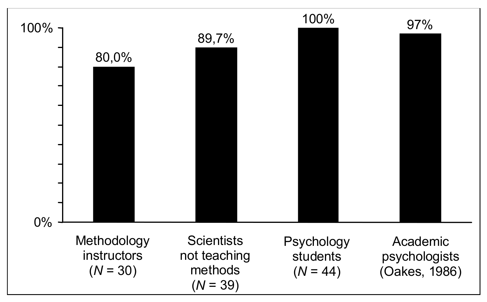
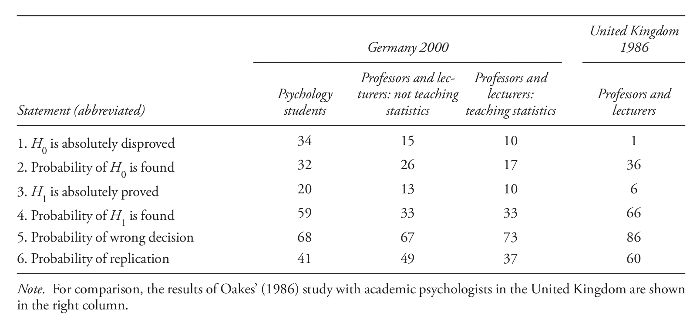
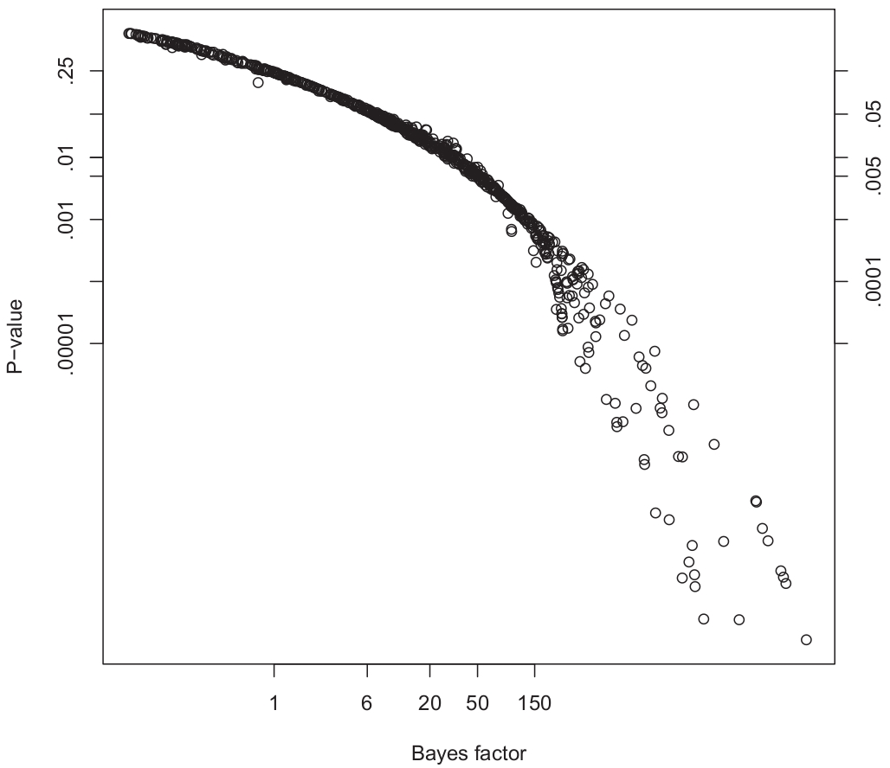
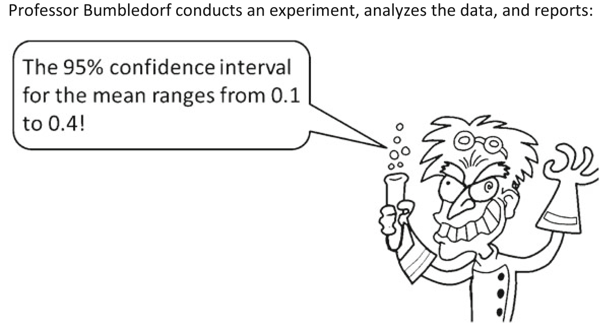
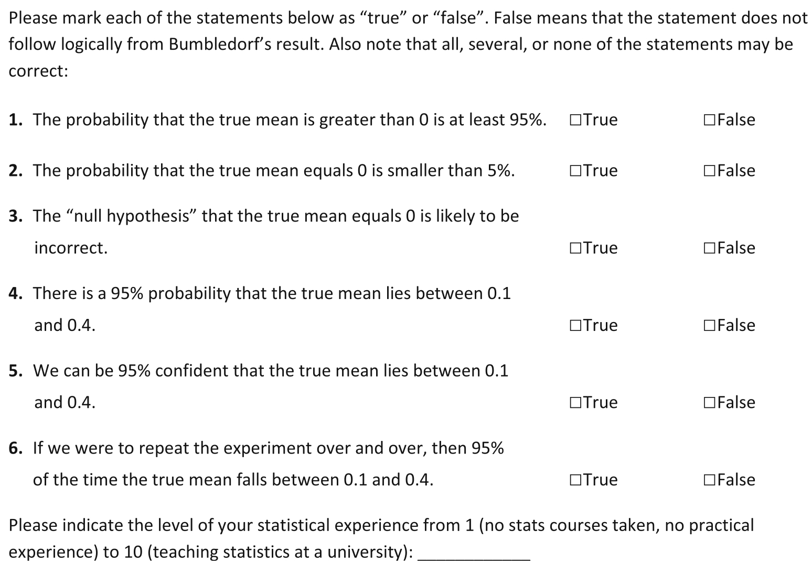
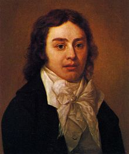

<!--
library(slidify)
setwd("~/juicy/BioStatWork2012/mytex/journalClub/pvaluesCI/pvalsCIslide")
slidify("index.Rmd")
publish(user="annlia", repo="pValuesCIs")
http://annlia.github.com/pValuesCIs
-->

<!-- If I am not mixing up memories, my first talk as part of this group was on Bayes factors... It seemed natural to close the loop before leaving :)  So I thought we can open the pandora box of statistical inference... The title is actually a working title, and it turns out that P values at the interface between classical and Bayesian statistics may be a better fit... but here we go. -->

## The null ritual

<table>
<tr>
  <td>
  <li>The null ritual: what you always wanted to know about significance testing but were afraid to ask  
  <cite>Gerd Gigerenzer, Stefan Krauss and Oliver Vitouch  
  The Sage handbook of quantitative methodology for the social sciences, 2004  
  </cite>
  </li>
  <li>"It is tempting, if the only tool you have is a hammer, to treat everything as if it were a nail." <cite>(A.H.Maslow, 1966, pp. 15-16)</cite>  
   </li>
   <li>"Don’t use a hammer to swat a fly off someone’s head."  
  <cite>John C Maxwell</cite> <a href="http://johnmaxwellonleadership.com/2011/03/29/don%E2%80%99t-use-a-hammer-to-swat-a-fly-off-someone%E2%80%99s-head/">link</a>
  </li>
  </td>
  <td>&nbsp;</td>
  <td> &nbsp; </td>
</tr>
</table>
  
<!-- Most claims about novel findings are based on the outcome of statistical hypothesis tests... 
* let them be under the classical frequentist framework or the Bayesian paradigm.  and confidence intervals?
There's indeed also a widespread feeling that they are actually used also when inappropriate.
This is well summarized by the Maslow quote reported by Gigerenzer... that "it is tempting, if the only tool you have is a hammer, to treat everything as if it were a nail." If you are trying to swat a fly off someone's head, that may not be the very best idea.(There maybe occasion where this may not be a good idea.)
However p-values are often seen by researchers as a way of (ratifying) providing scientific rigour to their findings, and sometimes, especially in applied fields, they are requested for publication more often than they are needed. Gigerenzer et al. refer to this attitude, within the Psychology literature, as the Null ritual. But this is really not limited to Psychology.
The featured product of the null ritual are of course P values.

Given the fundamental role of significance tests in the advance of science, it is no surprise that p-values are at the heart of the debate about the (non)-replicability and (non)-reproducibility of a large number of pulished studies ranging all the way from social science to medical research. p-values, once again, seem not only to be abused, but - one could say - routinely misinterpreted, and especially when it comes to headlines in the news. (But I don't want to give you too many hints for now.) What is more striking is that they tend to be misinterpreted among researchers in a wide range of fields.--> 

---

## Where do the misconceptions come from?

* The earth is round (p < .05)  
  <cite>Jacob Cohen, 1994, American Psychologist.</cite>
  
  "...this naked emperor has been shamelessly running around for a long time."

* Statistical Inference: A Commentary for the Social and Behavioural Sciences.  
  <cite>Michael Oakes, 1986, Wiley</cite>

* Misinterpretations of Significance: A Problem Students Share with Their Teachers?  
  <cite>Heiko Haller and Stefan Krauss  
  Methods of Psychological Research Online 2002, Vol.7, No.1</cite> 
  
  <table>
  <tr>
  <td>
  2 suspects: textbooks and statistics teachers 
  psychology departments of 6 German universities
  </td>
  <td>
  

    
  

  </td>
  </tr>
  </table>

---  

<!-- So where do the misconceptions come from? here are some references... "For over 70 years null P values have been the most common and yet most controversial inferential statistics," from the very first introduction of significance test by Ronald Fisher (1935)... It all started from a controversial cup of tea, and it still does not seem to be settled... much has been written in social science and especially psychology (not to talk about the philosohpy of science of course.). Jacob Cohen in 1994 already stressed the fact that the remarks about its misinterpretation were hardly original, and already in 1966 it had been said that pointing it out was akin to the boy who said the emperor was naked... Yet he concludes, and it seems to still be true another 20 years later, that "this naked emperor has been shamelessly running around for a long time."

According to Haller and Krauss the misinterpretation from the students' side is well documented, and often considered not surprising. However somebody is teaching them and some of them will eventually teach. They basically consider two suspects as possible sources of misconceptions, textbooks and statistics teachers (which I would say are very closely related). In 2002 they (Haller and Krauss) performed an experiment within the psychology departments of 6 German universities to assess the level of misinterpretation carried along by the instructors. If you don't mind before discussing their results (and giving too many hints) I would like to repropose the same questionnaire to you, so maybe we can check how we compare to psychologists... -->

## What does a significant result mean?

<!-- So like Gigerenzer et al 2004, we start by asking ourselves an (apparently) very simple question, What does a significant result mean? What can be concluded from a significant result? The original formulation of the questionnaire is the following... -->

What can be concluded from a significant result?

### The p-value questionnaire (Haller and Krauss, 2002)
Suppose you have a treatment that you suspect may alter performance on a certain task. You compare the means of your control and experimental groups (say 20 subjects in each sample). Further, suppose you use a simple independent means t-test and your result is (t = 2.7, d.f. = 18, p = 0.01). Please mark each of the statements below as “true” or “false.” False means that the statement does not follow logically from the above premises. Also note that several or none of the statements may be correct. 

 

Haller and Krauss asked 44 students, 39 lecturers and professors of psychology and 30 statistics teachers.

---

1. You have absolutely disproved the null hypothesis (that is, there is no difference between the population means). 

 [T] [F] 

2. You have found the probability of the null hypothesis being true. 

 [T] [F] 

3. You have absolutely proved your experimental hypothesis (that there is a difference between the population means). 

 [T] [F] 

4. You can deduce the probability of the experimental hypothesis being true. 

 [T] [F] 

5. You know, if you decide to reject the null hypothesis, the probability that you are making the wrong decision. 

 [T] [F] 

6. You have a reliable experimental finding in the sense that if, hypothetically, the experiment were repeated a great number of times, you would obtain a significant result on 99% of occasions.

 [T] [F] 

---

## Why all statements are wrong

### Definition
<table>
<tr>
<td>
p_value: the probability of the observed data (or of more extreme data points), given that the null hypothesis $H_0$ is true, defined in symbols as $p(D \vert H_0)$.
</td>
<td></td>
</tr>
</table>

* Statements 1 and 3: illusion of certainty
* Statements 2 and 4: $p(D \vert H_0) \neq p(H_0 \vert D)$ [wishful thinking]
* Statement 5: again a probability of a hypothesis [prosecutor's fallacy, e.g. [Sally Clark](http://understandinguncertainty.org/node/545)]
* Statement 6: replication fallacy, $p(D) \neq 1-p(D \vert H_0)$

---

<!-- In summary all six statements are characterized by "wishful thinking, they overestimate what can be concluded from a p_value". 

Comment on the results. All of you correctly spotted that all statements are wrong... that is very impressive... though I made the amateur mistake of leaving the paper on the printer for a little while... so we can skip the comments... and look at the performance of the psychologists in the study of Haller and Krauss, who seemed to be less lucky... 

"How many students and teachers noticed that all of the statements were wrong? As the Figure shows, none of the students did. Every student endorsed one or more of the illusions about the meaning of a p-value. One might think that these students lack the right genes for statistical thinking and are stubbornly resistant to education. A glance at the performance of their teachers, however, indicates that wishful thinking might not be entirely their fault. Ninety percent of the professors and lecturers also had illusions, a proportion almost as high as among their students. Most surprisingly, 80% of the statistics teachers shared illusions with their students. Thus, the students’ errors might be a direct consequence of their teachers’ wishful thinking.

If students “inherited” the illusions from their teachers, where did the teachers acquire them?"

Textbooks!
-->

## The psychologists' delusion about "p=.01"

 

_Percentage of participants in each group who endorsed at least one of the 6 statements._

 

---

<!-- "Which of the illusions were most often endorsed, and which relatively seldom? ... knowledge about what a significant result means does not seem to have improved since Oakes." -->

## A closer look at the single questions

 

_Percentage of false answers in the three groups._

 

---

<!--After discussing the results Haller and Krauss focus on teaching suggestions to avoid misconceptions in students' minds, since their paper is supposed to be pedagogical. However there is no evidence that much has changed (by looking at the current debates, for which I provide some links at the end...). I would like to move from one of their points to discuss some more recent debates... The call for improved education goes beyond the social science, and in some cases the use of p-values and statistical significance has been discouraged by authors and editors (such as in Epidemiology)...(Quoting Greenland and Poole). -->

## Bayes Rule

$$p(H_0 \vert D) = \frac{p(D \vert H_0) p(H_0)}{p(D \vert H_0)p(H_0) + p(D \vert H_1)p(H_1)}$$

### Point hypotheses examples
$$H_0: \theta = \theta_0 \mbox{ vs } H_1: \theta \neq \theta_0$$

### Difficulties

* priors on hypothesis?
$$p(H_0), p(H_1)$$

* non-trivial analysis, prior on parameter $$\pi(\theta)$$

---

## A Bayesian perspective as correction

* Living with P values. Resurrecting a Bayesian perspective on frequentist statistics.  
<cite> Sander Greenland and Charles Poole  
Epidemiology, 2013
</cite>

with discussion by Andrew Gelman:
<cite>"The formal view of the P value as a probability conditional on the null is mathematically correct but typically irrelevant to research goals (hence, the popularity of alternative—if wrong—interpretations)"</cite>

* Revised standards for statistical evidence.  
<cite> Valen E. Johnson  
PNAS, 2013 </cite>

with discussion by Gelman and Robert, Pericchi et al, Gaudart et al, 2014

* Uniformly most powerful Bayesian tests.  
  <cite> Valen E. Johnson  
  Annals of Statistics, 2013
  </cite>

---

<!-- \note{ One of the suggestions of Haller and Krauss is to introduce students to the Bayesian perspective, which contrary to the classical framework allows us to derive probabilities for the hypotheses, at the expenses however of having to define a prior...
All we need in fact to derive a posterior probability for a hypothesis is Bayes rule. This however requires that we have a prior belief, before we see any data, about the two hypotheses... and it requires to explicitely specify the alternative hypothesis. Even worse, is the fact that the analysis, with respect to possible prior distributions for the parameters for which we wish to make inference in general is non-trivial...But if we can solve all these problems, we are left at least with an easy interpretation, since what we get are indeed probabilities of our hypotheses.} -->

<!-- Many authors in fact share the idea that a correct Bayesian interpretation of P values can mitigate the problems associated with their misuse, due to their difficulty interpretation in "frequentist land". This is in particular advocated and the topic expanded upon by Greenland and Poole in a recent review article in epidemiology, 2013
As we have seen the most common misinterpretation of P values is viewing them as posterior probabilities of the truth of the null hypothesis. On the other hand its correct definition as "a probability conditional on the null is mathematically correct, but typically irrelevant to research goals". In other words "The p-value does not tell you if the result was due to chance. It tells you whether the results are consistent with being due to chance." (from a comment on Andrew's Blog) -->

## Classical and Bayesian (mis)-interpretation

### "P values are here to stay"
Gelman on Greenland and Poole

### Most common misinterpretation (frequentist)

"A p_value is the probability of chance finding."

The <a href="http://understandinguncertainty.org/explaining-5-sigma-higgs-how-well-did-they-do">Independent</a> about the Higgs 5 sigma
<cite>"meaning that there is less than a one in a million chance that their results are a statistical fluke."</cite>

### Most common Bayesian interpretation, turn them into Bayes factors

$$\mbox{BF}_{01} = \frac{P(H_0 \vert D)/P(H_1 \vert D)}{P(H_0)/P(H_1)}$$

a likelihood ratio for simple point hypotheses

50:50 and 1:4 $\Rightarrow 1/4$

---

<!-- As Greenland and Poole point out most misinterpretations derive from an attempt to answer Bayesian questions with frequentist statistics. Therefore it seems just right to clarify how they can be interpreted Bayesianly. The most common Bayesian interpretation of P values comes from turning them into Bayes factors. A Bayes factor is the ratio of posterior odds to prior odds. Namely if you have a 50:50 prior belief about your hypotheses, and you get a posterior odds for the null vs all other possibilities combined of 1:4, then your Bayes factor will be 1/4. -->

## Spike and slab

* Point probability prior $q$ at $\theta=\theta_0$
* Symmetric unimodal distribution around $\theta_0$ for the rest
* prior odds: $q/(1-q)$
* $P_0= .10, .05, .01 \Rightarrow$ lower bounds (normal priors) $\mbox{BF}_{01} = .63, .47, .15$

$$P_0=.05, q=1/2 \Rightarrow P(H_0 \vert D) \geq .47/(1+.47) = .32$$

### Conceptual difficulties
* cannot be read from tables
* require $q$, an arbitrary commitment to a single $\theta$

---

<!-- Gelman always stresses that spike-and-slab make little sense in applied context in epidemiology, political science and other fields in which true effects are typically nonzero. What is your view about genomics, do you believe in real zero effects? Since this is the only exceptional example often mentioned in much of Andrew's writing. -->

## Bayesian interpretations

* Define conditions under which $P$ values are indeed probability statements about the true parameter $\theta_t$. (Deep waters of improper, weak and subjective priors - Gelman)

### Alternative interpretations of P values

* measures of: goodness of fit, distance, consistency, compatibility between the observed data and the data generating model,   
  * $P_\theta$ probability transform of $\vert \theta - \hat{\theta}\vert$. Small $P_\theta \Rightarrow$ poor fit (but not limited to $\theta \neq \theta_t$)

* extreme-priors and weak priors (approximately true statements)
  * $P_\theta$: posterior probability that $\vert \hat{\theta} - \theta_t \vert > \vert \hat{\theta} - \theta \vert$
  * $P_\theta/2$: posterior probability that $\hat{\theta}$ is on the wrong side of $\theta$ with respect to $\theta_t$

* informative priors
  * bounds on posterior probabilities with prior restricted to a given class 

---

## Revised standards for statistical evidence

Val Johnson, PNAS 2013, ahead of printing

Motivation

* _"It ain't so much the things we don't know that get us into trouble. It's the things we know that just ain't so."_ Uncertain source.

* Lack of reproducibility of scientific studies 
  * [Why most published research finding are false,](http://www.plosmedicine.org/article/info%3Adoi%2F10.1371%2Fjournal.pmed.0020124) <cite>John Ioannidis, 2005, Plos Medicine</cite>

Due to unjustifiably high levels of significance?

Two frameworks for statistical hypothesis testing:
* Classical or frequentist, "significant" when test statistic exceeds a threshold
* Bayesian, posterior odds (require an alternative)

---

<!-- Non-reproducibility largely due to unjustifiable high standards? 
In the classical framework, a "finding" is declared significan if the value of a test statistic is above a prespecified threshold (by convention .05, .01). The Bayesian approach focuses on the calculation of posterior odds that the alternative is true given the observed data and any available information. Poterior odds are given by the prior odds, updated through the ratio of evidence provided by the data in favor of each hypothesis. The ratio of evidence is known as Bayes factor. When testing simple hypotheses the Bayes factor reduces to the likelihood ratio, that is the ratio of the sampling density of the data evaluated under the alternative hypothesis, to the sampling density of the data evaluated under the null hypothesis. In other words it represents the relative probability assigned to the data by the two hypotheses. For composite hypotheses the Bayes factor will be the ratio of the marginal likelihoods when integrating with respect to the prior density of the parameters under each hypothesis (or average sampling density of the observed data under each hypotheses with respect to the prior desity of the unknown parameter under each of them). As noticed before, the two approaches may lead to different conclusions, which depend on the class of the prior densities. Johnson defines a procedure based on Bayesian tests which allows us to define a calibration between P values and Bayes Factors -->

<!-- The relation between the calssical and Bayesian approach to statistical hypothesis testing is also the starting point of the PNAS paper by Val Johnson. The flavour is somewhat different. Johnson in fact starts from the discrepancy between the the results produced by the two approaches as a reason to redefine thresholds for statistical evidence in the classical paradigm, so that the results are in agreement. From a scientific point of view his motivation comes once more from the recently much debated non-reproducibility of many scientific studies. Think once more of Ioannidis controversial paper and the flow of research that has been originated on the topic, leading more recently to the definition of Science-wise discovery rate, which much arguing from all sides. Johnson's point of view is that much of the non-reproducibility comes from the routine use widely accepted statistical testing procedures...-->

<!-- In the case of simple null and alternative hypotheses, the Bayes factor represents the ratio of the sampling density of the data evaluated under the alternative hypothesis to the sampling density of the data evaluated under the null hypothesis. That is, it represents the relative probability assigned to the data by the two hypotheses. For composite hypotheses, the Bayes factor represents the ratio of the average value of the sampling density of the observed data under each of the two hypotheses, averaged with respect to the prior density specified on the unknown parameters under each hypothesis. -->

## Uniformly most powerful Bayesian tests

* Can P values and Bayes factors be calibrated to yield similar conclusions?
* Connection between UMPT and UMPBT
* By analogy to the Neymann Pearson lemma, define UMPBT such that
  * Given equipoise $P(H_0)=P(H_1)=.5$
  * Evidence threshold $\gamma>0$
  * For any $\theta_g \in \Theta$ and all alternative $H_{1'}: \theta \thicksim \pi_{1'}$
$$P_{\theta_g} (\mbox{BF}_{10}(x) > \gamma) \geq P_{\theta_g} (\mbox{BF}_{1'0}(x) > \gamma)$$
* Correspondence between size of classical tests and evidence threshold
* Rejection regions can be matched exactly
* Decisions will match!

---

## P values vs UMPBT Bayes factors

<table>
<tr>
  <td> &nbsp; </td>
    <td>&nbsp;</td>
   <td>
  <li>Common thresholds correspond to only moderate evidence against the null </li>
  <li>Correct the problem by raising thresholds (lower significance levels) </li>
  <li>But beware: "Don’t use a hammer to swat a fly off someone’s head."  
  Raising the bar does not come for free!
  </li>
  </td>
</tr>
</table>

---

<!-- Johnson moves from the observation that Bayes factors require an alternative hypothesisdefault to propose a method which produces default Bayesian procedures that are uniformly most powerful in the sense that they maximise the probability that the Bayes factor in favor of the alternative hypothesis exceeds a given threshold.
-->

## The same game with confidence intervals
 
<table>
<tr>
<td>
</td>
<td>
 
 
 </td>
</tr>
</table>

---

## Weakly informative blog entries

1. [Misunderstanding the p-value] (http://andrewgelman.com/2013/03/12/misunderstanding-the-p-value/)
2. [Double Misunderstandings About p-values](http://normaldeviate.wordpress.com/2013/03/14/double-misunderstandings-about-p-values/#comment-7709)
3. [P-values and statistical practice](http://andrewgelman.com/2013/02/08/p-values-and-statistical-practice/)
4. [Difficulties in making inferences about scientific truth from distributions of published p-values](http://andrewgelman.com/2013/09/26/difficulties-in-making-inferences-about-scientific-truth-from-distributions-of-published-p-values/)
5. [“Are all significant p-values created equal?”](http://andrewgelman.com/2013/11/15/are-all-significant-p-values-created-equal/)
6. [Forum in Ecology on p-values and model selection](http://andrewgelman.com/2014/05/17/forum-ecology-p-values-model-selection/)
7. Revised evidence for statistical standards ([Gelman](http://andrewgelman.com/2013/12/19/revised-evidence-statistical-standards/), [Xian](http://xianblog.wordpress.com/2013/12/19/revised-evidence-for-statistical-standards/) )
8. [Revised statistical standards for evidence (comments to Val Johnson’s comments on our comments on Val’s comments on p-values)](http://andrewgelman.com/2014/04/25/revised-statistical-standards-evidence-comments-val-johnsons-comments-comments-vals-comments-p-values/)
9. [Jessica Tracy and Alec Beall (authors of the fertile-women-wear-pink study) comment on our Garden of Forking Paths paper, and I comment on their comments](http://andrewgelman.com/2014/05/31/jessica-tracy-alec-beall-authors-fertile-women-wear-pink-study-comment-garden-forking-paths-paper-comment-comments/)

---

## Statistically significant papers
1. [Forum—P Values and Model Selection](http://www.esajournals.org/toc/ecol/95/3), <cite>March 2014, Ecology special issue</cite>
2. [Revised standards for statistical evidence](http://www.pnas.org/content/early/2013/10/28/1313476110.abstract?tab=related), <cite>Valen E. Johnson, PNAS 2013, ahead of printing</cite>
3. [An estimate of the science-wise false discovery rate and application to the top medical literature](http://biostatistics.oxfordjournals.org/content/15/1/1),
<cite>Leah R. Jager and Jeffrey T. Leek, Biostatistics (2014) </cite>, with mixed discussions (e.g. Yoav Benjamini, David R. Cox, Andrew Gelman, John P. A. Ioannidis)
3. [The garden of forking paths: Why multiple comparisons can be a problem,
even when there is no _"fishing expedition"_ or _"$p$-hacking"_ and the research
hypothesis was posited ahead of time](http://www.stat.columbia.edu/~gelman/research/unpublished/p_hacking.pdf), <cite>Gelman and Loken, 2013 </cite>
9. [Too Good to Be True.] (http://www.slate.com/articles/health_and_science/science/2013/07/statistics_and_psychology_multiple_comparisons_give_spurious_results.html) Statistics may say that women wear red when they’re fertile … but you can’t always trust statistics.
4. [Why we (usually) don't need to worry about multiple comparisons](http://www.stat.columbia.edu/~gelman/research/published/multiple2f.pdf), <cite>Gelman et al, 2012 </cite>

--- .class #id 

## Some evidence that most published research is false

6. [I don’t believe the paper, “Empirical estimates suggest most published medical research is true.” That is, most published medical research may well be true, but I’m not at all convinced by the analysis being used to support this claim.](http://andrewgelman.com/2013/01/24/i-dont-believe-the-paper-empirical-estimates-suggest-most-published-medical-research-is-true-that-is-the-claim-may-very-well-be-true-but-im-not-at-all-convinced-by-the-analysis-being-used/) (January 2013)
5. [Statistical significance and the dangerous lure of certainty](http://andrewgelman.com/2013/08/08/statistical-significance-and-the-dangerous-lure-of-certainty/) (August 2013)
3. [Difficulties in making inferences about scientific truth from distributions of published p-values](http://andrewgelman.com/2013/09/26/difficulties-in-making-inferences-about-scientific-truth-from-distributions-of-published-p-values/) (September 2013)
1. [A summary of the evidence that most published research is false](http://simplystatistics.org/2013/12/16/a-summary-of-the-evidence-that-most-published-research-is-false/)
2. [Is most science false? The titans weigh in](http://simplystatistics.org/2013/09/25/is-most-science-false-the-titans-weigh-in/)
4. [The replication and criticism movement is not about suppressing speculative research; rather, it’s all about enabling science’s fabled self-correcting nature](http://andrewgelman.com/2014/02/19/replication-criticism-movement-suppressing-speculative-research-rather-enabling-sciences-fabled-self-correcting-nature/) (February 2014)

---

## Water, water, every where,
###    Nor any drop to drink

The Rime of the Ancient Mariner, Samuel Taylor Coleridge, 1798

### Lies, damned lies and... big data. The rise and fall of statistics.

<!-- Concerns about the (non)reproducibility of scientific studies are actually all over the place, so much that a "Web site, Retraction Watch, has been established to monitor the large number of retracted studies." Since the well known, controversial paper by Ioannidis in 2005, with the provocative title "Why most published research findings are false", assessing the reliability of published studies has developed into a field of research on its own account, and it is a relatively active one... Not only by Ioannidis... In 2013 Leek and ?? defined the Science wise false discovery rate in a paper published with discussions in Biostatistics. Needless to say, they did not reach any consent on whether published research is to be trusted. At the end of 2013 Val Johnson advocates the need for revised standards for statistical inference in a paper published in PNAS, which again has been heavily criticized in published discussions, appeared online in PNAS in April this year (2014) -->
